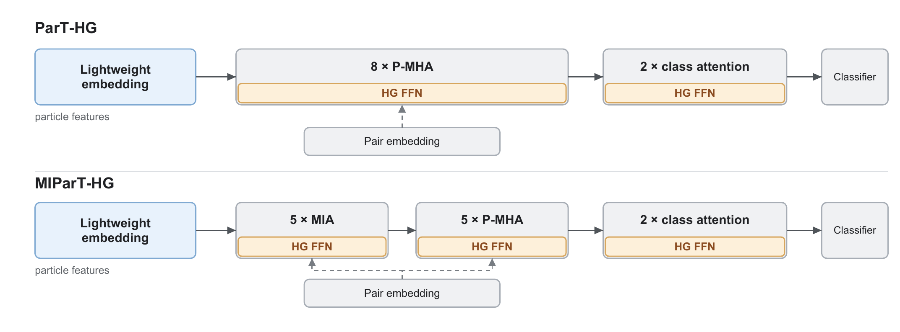

# Assessing Parameter Redundancy in Transformers for Jet Tagging

This repository provides the PyTorch implementation accompanying **"Assessing Parameter Redundancy in Transformers for Jet Tagging"**.

It contains two parameter-efficient Transformer jet taggers based on the [Particle Transformer (ParT)](https://github.com/jet-universe/particle_transformer) and the [More-Interaction Particle Transformer (MIParT)](https://github.com/USST-HEP/MIParT): **ParT-HG** and **MIParT-HG**.

## Introduction

ParT-HG and MIParT-HG reduce the parameters in two components while keeping the pairwise-interaction embedding and attention mechanisms unchanged:

- **Lightweight particle embedding:** replaces the original dense embedding with a grouped channelwise expansion followed by two pointwise projections,
  `C -> 4C -> d/2 -> d`.
- **Hourglass FFN:** replaces each conventional `d -> 4d -> d` FFN with two residual bottleneck subblocks, each following `d -> d/2 -> d`.

The default ParT-HG model uses `d=128`, while MIParT-HG uses `d=64`. Both models use two hourglass subblocks with a bottleneck ratio of `0.5`.



## Getting Started

### Install Weaver

Training is based on the [Weaver](https://github.com/hqucms/weaver-core) framework:

```bash
git clone https://github.com/hqucms/weaver-core.git
cd weaver-core
pip install -e .
cd ..
```

### Set up the Particle Transformer repository

Clone the official ParT repository, which provides the dataset configurations and training scripts:

```bash
git clone https://github.com/jet-universe/particle_transformer.git
cd particle_transformer
```

Copy the model file or files that you want to use into `particle_transformer/networks/`:

```bash
cp /path/to/ParT_hourglass.py networks/
cp /path/to/MIParticleTransformer_hourglass.py networks/
```

### Download datasets

Use the download script provided by the ParT repository:

```bash
./get_datasets.py [JetClass|QuarkGluon|TopLandscape] -d DATA_DIR
```

### Training

Add ParT-HG and/or MIParT-HG to the model-selection block in the corresponding ParT training script. For example, in `train_QuarkGluon.sh`:

```bash
elif [[ "$model" == "ParT-HG" ]]; then
    modelopts="networks/ParT_hourglass.py --use-amp --optimizer-option weight_decay 0.01"
    lr="1e-3"
elif [[ "$model" == "MIParT-HG" ]]; then
    modelopts="networks/MIParticleTransformer_hourglass.py --use-amp --optimizer-option weight_decay 0.01"
    lr="1e-3"
```

Then run the original training script with the corresponding model name and feature set:

```bash
./train_QuarkGluon.sh ParT-HG kinpidplus
```

or

```bash
./train_QuarkGluon.sh MIParT-HG kinpidplus
```

The same setup can be applied to the JetClass and TopLandscape training scripts. Other dataset and training options follow the original [ParT repository](https://github.com/jet-universe/particle_transformer).

## Citation

If you use this code, please cite:

```bibtex
@article{Cheng2026Assessing,
  title  = {Assessing Parameter Redundancy in Transformers for Jet Tagging},
  author = {Cheng, Huitong and Dong, Yabo and Fan, Jun and Wang, Kun and Yang, Haijun and Zhu, Jingya and Zhu, Yifan},
  year   = {2026},
  note   = {Preprint}
}
```

Please also cite the original [ParT paper](https://arxiv.org/abs/2202.03772) and [MIParT paper](https://arxiv.org/abs/2407.08682).
